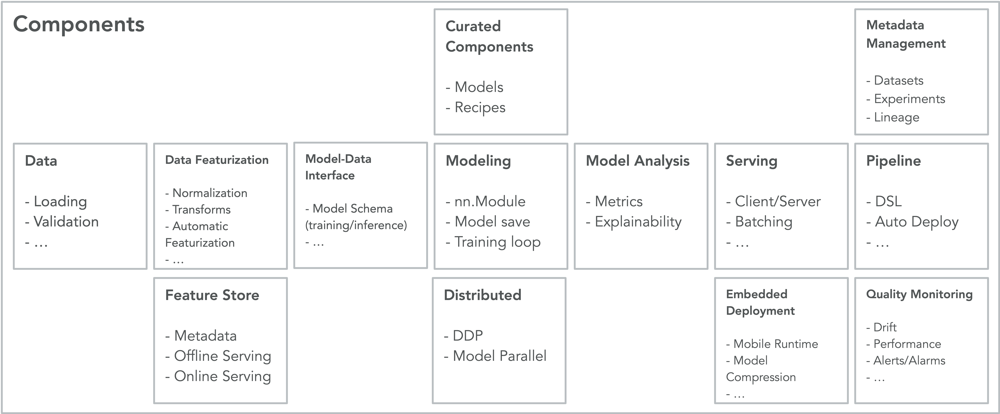

Overview
======================

Components are reusable, parameterized job templates. Each component is a
Python function that returns an :py:class:`~torchx.specs.AppDef` -- a
scheduler-agnostic job definition. Instead of writing raw YAML or
scheduler-specific configs, you call a component from the CLI or Python and
TorchX handles the rest.

**CLI:**

.. code-block:: shell

   torchx run --scheduler local_cwd utils.python --script my_app.py

**Python API:**

.. code-block:: python

   from torchx.runner import get_runner

   with get_runner() as runner:
       runner.run_component(
           "utils.python",
           ["--script", "my_app.py"],
           scheduler="local_cwd",
       )

TorchX ships the following component categories out of the box:

.. list-table::
   :header-rows: 1
   :widths: 20 50 30

   * - Category
     - What it does
     - Example use case
   * - :doc:`train`
     - Single-node training launchers
     - Fine-tuning a model on one GPU
   * - :doc:`distributed`
     - Multi-node / multi-GPU training via TorchElastic
     - Large-scale distributed training (``dist.ddp``)
   * - :doc:`interpret`
     - Model interpretability jobs (Captum)
     - Generating feature attributions
   * - :doc:`metrics`
     - Metric collection and reporting
     - TensorBoard log aggregation
   * - :doc:`serve`
     - Model serving (TorchServe)
     - Deploying a model behind an HTTP endpoint
   * - :doc:`utils`
     - General-purpose utilities
     - Running an arbitrary Python script (``utils.python``)

.. note::

   Diagram above for illustration purposes only. Not all boxes are currently
   available out-of-the-box.

.. automodule:: torchx.components
.. currentmodule:: torchx.components

.. seealso::

   :doc:`/component_best_practices`
      Best practices for authoring reusable components.

   :doc:`/custom_components`
      Guide for writing and launching custom components.
