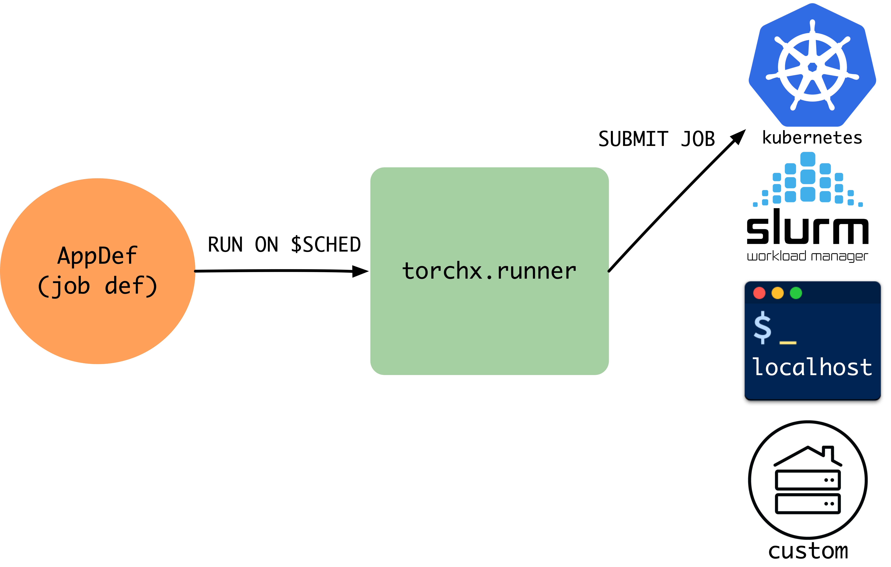

torchx.schedulers
====================

.. tip::

   Schedulers translate portable AppDefs into backend-specific jobs. This page
   covers the built-in schedulers, the custom scheduler interface, and config
   options (StructuredOpts vs runopts).

Each scheduler translates a scheduler-agnostic
:py:class:`~torchx.specs.AppDef` into a native job format (Kubernetes Job,
Slurm sbatch, AWS Batch job, etc.) and manages the job lifecycle. Because the
interface is pluggable, you switch backends without changing application code.
TorchX ships with schedulers for:

* **Local development:** ``local_cwd``, ``local_docker``
* **HPC (High-Performance Computing) clusters:** ``slurm``, ``lsf``
* **Cloud / container orchestrators:** ``kubernetes``, ``aws_batch``,
  ``aws_sagemaker``

Need a scheduler that isn't listed? See
:ref:`Implementing a Custom Scheduler <implementing-scheduler>` below and
:ref:`advanced:Registering Custom Schedulers` for entry-point registration.

Choosing a Scheduler
-----------------------

Every scheduler accepts the same ``AppDef``; only the ``--scheduler`` flag
(CLI) or ``scheduler=`` argument (Python API) changes.

.. list-table::
   :header-rows: 1
   :widths: 18 20 22 40

   * - Scheduler
     - Environment
     - What it produces
     - Best for
   * - ``local_cwd``
     - Your laptop / devserver
     - Local process (``subprocess.Popen``)
     - Rapid iteration. No containers, no cluster access needed.
   * - ``local_docker``
     - Local Docker daemon
     - Docker container with patched image
     - Testing container behavior locally before deploying to a cluster.
   * - ``kubernetes``
     - Kubernetes cluster
     - Kubernetes ``Job`` resource
     - Production workloads on Kubernetes. Requires cluster access and a
       container registry.
   * - ``kubernetes_mcad``
     - Kubernetes + MCAD
     - MCAD ``AppWrapper`` resource
     - Gang-scheduled multi-node jobs on Kubernetes with the Multi-Cluster
       Application Dispatcher.
   * - ``slurm``
     - Slurm HPC cluster
     - ``sbatch`` script
     - Traditional HPC environments. Uses the shared filesystem as the
       workspace (no container build needed).
   * - ``aws_batch``
     - AWS
     - AWS Batch job definition + job
     - AWS-native batch compute. Requires a Batch compute environment and
       job queue.
   * - ``aws_sagemaker``
     - AWS
     - SageMaker training job
     - Managed training with SageMaker features (spot instances, managed
       infrastructure).
   * - ``lsf``
     - IBM LSF cluster
     - ``bsub`` script
     - Enterprise HPC environments running IBM Spectrum LSF.

.. _implementing-scheduler:

Implementing a Custom Scheduler
---------------------------------

Subclass :py:class:`~torchx.schedulers.api.Scheduler` and implement the
abstract methods. ``Scheduler`` is generic over a config type ``T`` (typically
``Mapping[str, CfgVal]``) that flows through to ``_submit_dryrun``. A
:term:`dryrun <Dryrun>` builds the scheduler-native request without submitting
-- returning an :py:class:`~torchx.specs.AppDryRunInfo` wrapping your native
request type (e.g. a Kubernetes ``V1Job``, a Slurm sbatch script).

The submission flow is:

.. code-block:: text

   Runner.run(app, scheduler, cfg)
       │
       ▼
   Runner.dryrun(app, scheduler, cfg)
       │
       ├── resolve cfg from .torchxconfig + overrides
       ├── build workspace (if WorkspaceMixin)
       │
       ▼
   Scheduler.submit_dryrun(app, cfg)
       │
       ├── Scheduler._submit_dryrun(app, cfg)
       │       └── translate AppDef + cfg ──► native request (e.g. V1Job, sbatch)
       ├── run Role.pre_proc hooks (per role, in order)
       │
       ▼
   AppDryRunInfo[NativeRequest]
       │
       ▼
   Runner.schedule(dryrun_info)
       │
       ▼
   Scheduler.schedule(dryrun_info)
       │
       ├── submit native request to backend
       │
       ▼
   app_id (str)

After submission, the Runner can query the job via ``Scheduler.describe``,
stream logs via ``Scheduler.log_iter``, or cancel via
``Scheduler._cancel_existing``.

Method Reference
^^^^^^^^^^^^^^^^^^

.. list-table::
   :header-rows: 1
   :widths: 35 15 50

   * - Method
     - Required
     - Purpose
   * - ``_submit_dryrun(app, cfg) -> AppDryRunInfo[T]``
     - Yes
     - Translate an :py:class:`~torchx.specs.AppDef` + resolved config into
       your native request type ``T``. Do **not** submit — just build the request.
   * - ``schedule(dryrun_info) -> str``
     - Yes
     - Submit the native request and return the scheduler-assigned ``app_id``.
   * - ``describe(app_id) -> DescribeAppResponse | None``
     - Yes
     - Query job status. Return ``None`` if the job no longer exists.
   * - ``list(cfg) -> list[ListAppResponse]``
     - Yes
     - List jobs visible to this scheduler.
   * - ``_cancel_existing(app_id) -> None``
     - Yes
     - Cancel a running job (called only if the job exists).
   * - ``_run_opts() -> runopts``
     - No
     - Declare scheduler-specific config options (see
       :py:class:`~torchx.schedulers.api.StructuredOpts`). The public
       ``run_opts()`` method calls ``_run_opts()`` and automatically merges
       workspace options if the scheduler inherits from
       :py:class:`~torchx.workspace.WorkspaceMixin`.
   * - ``log_iter(app_id, role_name, k, ...) -> Iterable[str]``
     - No
     - Stream log lines. Default raises ``NotImplementedError``.
   * - ``_pre_build_validate(app, scheduler, cfg) -> None``
     - No
     - Pre-workspace-build validation hook. Called before workspace
       building. Override to reject invalid configs early.
   * - ``_validate(app, scheduler, cfg) -> None``
     - No
     - Post-workspace-build validation hook. The default implementation
       checks that every role has a non-null resource.
   * - ``_delete_existing(app_id) -> None``
     - No
     - Delete a job definition from the scheduler's data plane. Default
       delegates to ``_cancel_existing``. Override for schedulers with
       persistent definitions (e.g. Kubernetes, AWS Batch).
   * - ``close() -> None``
     - No
     - Release local resources. Default is a no-op.

Minimal Skeleton
^^^^^^^^^^^^^^^^^^

.. code-block:: python

   from dataclasses import dataclass
   from typing import Any, Mapping

   from torchx.schedulers.api import (
       DescribeAppResponse,
       ListAppResponse,
       Scheduler,
       StructuredOpts,
   )
   from torchx.specs import AppDef, AppDryRunInfo, CfgVal, runopts

   # 1. Define your native request type
   @dataclass
   class MyRequest:
       job_name: str
       cmd: list[str]
       env: dict[str, str]

   # 2. (Optional) Define typed config via StructuredOpts
   @dataclass
   class MyOpts(StructuredOpts):
       cluster: str = "default"
       """Name of the cluster to submit to."""

       queue: str = "gpu"
       """Queue / partition for the job."""

   # 3. Implement the Scheduler
   class MyScheduler(Scheduler[Mapping[str, CfgVal]]):

       def __init__(self, session_name: str, **kwargs: object) -> None:
           super().__init__("my_backend", session_name)

       def _run_opts(self) -> runopts:
           return MyOpts.as_runopts()

       def _submit_dryrun(
           self, app: AppDef, cfg: Mapping[str, CfgVal]
       ) -> AppDryRunInfo[MyRequest]:
           opts = MyOpts.from_cfg(cfg)
           role = app.roles[0]
           request = MyRequest(
               job_name=app.name,
               cmd=[role.entrypoint, *role.args],
               env=dict(role.env),
           )
           return AppDryRunInfo(request, repr)

       def schedule(self, dryrun_info: AppDryRunInfo[MyRequest]) -> str:
           request: MyRequest = dryrun_info.request
           # ... submit to your backend ...
           return "my-backend-job-id-123"

       def describe(self, app_id: str) -> DescribeAppResponse | None:
           # ... query your backend ...
           return DescribeAppResponse(app_id=app_id)

       def list(
           self, cfg: Mapping[str, CfgVal] | None = None
       ) -> list[ListAppResponse]:
           # ... list jobs ...
           return []

       def _cancel_existing(self, app_id: str) -> None:
           # ... cancel the job ...
           pass

   # 4. Factory function (entry-point target)
   def create_scheduler(session_name: str, **kwargs: Any) -> MyScheduler:
       return MyScheduler(session_name)

Register the factory via a ``torchx.schedulers`` entry point
(see :ref:`advanced:Registering Custom Schedulers`):

.. code-block:: python

   # setup.py
   entry_points={
       "torchx.schedulers": [
           "my_backend = my_package.scheduler:create_scheduler",
       ],
   }

Or in ``pyproject.toml``:

.. code-block:: toml

   [project.entry-points."torchx.schedulers"]
   my_backend = "my_package.scheduler:create_scheduler"

Testing Your Scheduler
^^^^^^^^^^^^^^^^^^^^^^^^

Study ``torchx/schedulers/test/api_test.py`` for the canonical test patterns.
A minimal test creates the scheduler, calls ``submit_dryrun`` with a test
``AppDef``, and asserts the native request is correct:

.. code-block:: python

   import unittest
   from torchx.specs import AppDef, Role, Resource

   class MySchedulerTest(unittest.TestCase):
       def setUp(self) -> None:
           self.scheduler = MyScheduler(session_name="test")

       def test_submit_dryrun(self) -> None:
           app = AppDef(
               name="test_app",
               roles=[Role(name="worker", image="img", entrypoint="echo",
                           args=["hello"], resource=Resource(cpu=1, gpu=0, memMB=512))],
           )
           dryrun_info = self.scheduler.submit_dryrun(app, cfg={"cluster": "test"})
           request = dryrun_info.request
           self.assertEqual(request.job_name, "test_app")

       def test_run_opts(self) -> None:
           opts = self.scheduler.run_opts()
           self.assertIn("cluster", {name for name, _ in opts})

Common Pitfalls
^^^^^^^^^^^^^^^^^

* **Forgetting ``super().__init__()``**: Always call
  ``super().__init__("my_backend", session_name)`` in your ``__init__``. The
  ``backend`` string is used by the Runner to construct
  :py:data:`~torchx.specs.AppHandle` strings (``my_backend://session/app_id``).
  Omitting it causes opaque errors when the Runner tries to route calls.

* **Missing the factory function**: The entry point must point to a factory
  function (``def create_scheduler(session_name: str, **kwargs: object) -> Scheduler``),
  not the class itself. The Runner calls this factory with ``session_name`` and
  optional ``**kwargs``.

* **Returning the wrong type from ``_submit_dryrun``**: The second argument to
  ``AppDryRunInfo(request, repr_fn)`` is a callable that renders the request for
  ``torchx run --dryrun``. Pass ``repr`` or a custom formatter -- do not omit it.

* **Not handling ``cfg=None`` in ``list()``**: The ``list`` method receives
  ``cfg=None`` when called without config. Guard against ``None`` before
  accessing config keys.

Config Options (StructuredOpts vs runopts)
^^^^^^^^^^^^^^^^^^^^^^^^^^^^^^^^^^^^^^^^^^^^

Two approaches for declaring scheduler config:

1. **StructuredOpts** (recommended) — define a ``@dataclass`` subclass. Fields
   become typed config options with auto-generated help text from docstrings:

   .. code-block:: python

      @dataclass
      class MyOpts(StructuredOpts):
          cluster: str = "default"
          """Name of the cluster to submit to."""

          queue: str = "gpu"
          """Queue / partition for the job."""

      # In your scheduler:
      def _run_opts(self) -> runopts:
          return MyOpts.as_runopts()

      def _submit_dryrun(self, app, cfg):
          opts = MyOpts.from_cfg(cfg)  # typed access: opts.cluster, opts.queue

2. **Manual runopts** — build the options imperatively:

   .. code-block:: python

      def _run_opts(self) -> runopts:
          opts = runopts()
          opts.add("cluster", type_=str, default="default", help="Cluster name")
          opts.add("queue", type_=str, default="gpu", help="Queue / partition")
          return opts

Adding Workspace Support
^^^^^^^^^^^^^^^^^^^^^^^^^^

To support automatic image patching, inherit from a
:py:class:`~torchx.workspace.WorkspaceMixin` alongside ``Scheduler``:

.. code-block:: python

   from torchx.workspace.docker_workspace import DockerWorkspaceMixin

   class MyScheduler(DockerWorkspaceMixin, Scheduler[Mapping[str, CfgVal]]):
       def __init__(self, session_name: str, **kwargs: object) -> None:
           super().__init__("my_backend", session_name)
       # ... rest of scheduler methods ...

TorchX ships two workspace mixins:
:py:class:`~torchx.workspace.docker_workspace.DockerWorkspaceMixin` (for
container-based schedulers like Kubernetes and AWS Batch) and
:py:class:`~torchx.workspace.dir_workspace.DirWorkspaceMixin` (for
shared-filesystem schedulers like Slurm and LSF). You can also subclass
:py:class:`~torchx.workspace.WorkspaceMixin` directly for custom strategies.

See :doc:`workspace` for the full workspace API, built-in mixin reference,
and a guide to implementing your own workspace mixin.

Existing Implementations
^^^^^^^^^^^^^^^^^^^^^^^^^^

Study these for real-world patterns:

* ``torchx.schedulers.local_scheduler`` — uses ``StructuredOpts``, no workspace mixin, runs jobs via ``subprocess.Popen``
* ``torchx.schedulers.slurm_scheduler`` — uses ``DirWorkspaceMixin``, generates ``sbatch`` scripts
* ``torchx.schedulers.kubernetes_scheduler`` — uses ``DockerWorkspaceMixin``, creates Kubernetes ``V1Job`` resources

All Schedulers
----------------

.. toctree::
   :maxdepth: 1
   :glob:

   schedulers/*

.. fbcode::

   .. toctree::
      :maxdepth: 1
      :glob:

      schedulers/fb/*

Scheduler Functions
--------------------

.. automodule:: torchx.schedulers
.. currentmodule:: torchx.schedulers

.. autofunction:: get_scheduler_factories
.. autofunction:: get_default_scheduler_name

Scheduler Classes
-------------------
.. currentmodule:: torchx.schedulers.api

.. autoclass:: Scheduler
   :members:

.. autoclass:: StructuredOpts
   :members:

.. autoclass:: DescribeAppResponse
   :members:

.. autoclass:: ListAppResponse
   :members:

.. autoclass:: Stream
   :members:

.. seealso::

   :doc:`advanced`
      Registering custom schedulers, resources, and components via entry points.

   :doc:`workspace`
      Workspace API reference and custom workspace mixin guide.

   :doc:`api_reference`
      Single-page reference for users of TorchX (imports, types, and recipes).
